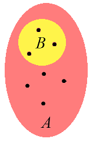
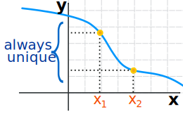

# [MAT 1140 – Strukturer og argumenter](https://www.uio.no/studier/emner/matnat/math/MAT1140/h19/index.html "MAT 1140 - Strukturer og argumenter")

## Kort om emnet
MAT1140 er en første innføring i abstrakt matematikk. Emnet introduserer matematiske strukturer som er felles for mange fagområder, og det gir studentene trening i å argumentere matematisk. Emnet forutsetter ikke faglige kunnskaper utover videregående skole (R1+R2), men det er en fordel å ha vært eksponert for matematisk argumentasjon. MAT1140 gir et solid grunnlag for videre arbeid med teoretiske matematikkemner.

## Hva lærer du?
Etter å ha fullført emnet:

- vet du hvordan man analyserer det logiske forholdet mellom enkle utsagn, kjenner vanlige bevisteknikker, og kan presentere egne matematiske argumenter på en klar og velorganisert måte ved hjelp av korrekt notasjon og terminologi;

- kjenner du mengdebegrepet og de Boolske operasjonene, kan gjennomføre argumenter med mengder og familier av mengder, kjenner kardinalitetsbegrepet og de viktigste egenskapene til tellbare mengder;

- kjenner du funksjons- og relasjonsbegrepene, kan bruke funksjoner og relasjoner til å beskrive matematiske sammenhenger, og kan gjenkjenne og bruke ekvivalensrelasjoner og partielle ordninger;

- vet du hvordan hele tall er bygget opp av primtall, kan argumentere med restklasser, og kjenner karakteriseringer av pytagoreiske tripler og kvadratsummer;

- kjenner du de grunnleggende egenskapene til noen algebraiske strukturer, spesielt ringer og kropper, og hvordan dette belyser eksempler som reelle tall og polynomer;

- kjenner du utvalgsaksiomet og Zorns lemma og kan gjennomføre argumenter basert på dem.

## Høst 2019

## Set Theory Axioms
Specifically, ZFC is a collection of approximately 9 axioms (depending on convention and precise formulation) that, taken together, define the core of mathematics through the usage of set theory. More formally, ZFC is a predicate logic equipped with a binary relation ∈, which refers to set membership and is read as "in". To be clear, it is said that a∈b when **a** is an element of **b**.
<!--more-->
### Notation
In general, statements in set theory are expressed using first-order logic, which uses a number of quantifiers (or logical symbols):

- $\in$ means "is in", as in the introduction.
- $\forall$ means "for all"; e.g. $\forall n\in \mathbb{R} : n^2 \geq 0$ (translated: for all real $n, n^2 \geq 0$) is a way of expressing the trivial inequality.
- $\exists$ means "there exists"; e.g. $\forall x\in \mathbb{R} (\exists y\in \mathbb{R} : y^3=x)$ (translated: for all real $x$, there exists a real $y$ such that y^3=x) is a way of stating that every real number has a real cube root.
- $\equiv$ means "is equivalent to". For example, $x^3>0\equiv x>0$ is a way of expressing the fact that $x^3$ is positive if and only if $x$ is positive.
- $\implies$ means "implies". For example, $x>0 \implies x^2>0$ s a way of expressing the fact that the square of a positive number is positive. Note that $x>0\not\equiv 2>0$, since $x^2>0 \implies x>0$ is a false statement (e.g. for $x=−1$).
- $\land$ means "logical and"; e.g. $n^2>0\land n^3 < 0$ is a way of expressing the fact that $n^2$ is positive and $n^3$ is negative; i.e. $n$ is negative.

This allows for the axioms in ZFC to be stated succinctly using symbols, as in the following section.

### Formal Definition (Axioms)
The axioms of ZFC can be stated in several equivalent ways, and have slightly different names and logical formulations depending on the source. Of course, each individual source will have a rigorous correct treatment of the axioms, one of which follows:

#### <b>Axiom of extensionality</b>
$$∀u(u∈X≡u∈Y)⟹X=Y$$
::: tip
In other words, if $u \in X \iff u\in Y$ for all $u$, then $X=Y$. In plain language, this statement is equivalent to "If two sets have the same elements, they are the same set."
:::
#### <b>Axiom of pairing</b>
$$∀a∀b∃z∀x(x∈z≡(x=a∨x=b)),$$
where $\lor$ denotes the logical or quantifier.
::: tip
In other words, for all $a$ and $b$, there exists a $z$ such that for all $x$, $x \in Z$ is equivalent to the statement "$x=a$ or $x=b$". In plain language, this statement is equivalent to "Given two elements, there exists a set containing exactly those two elements."
:::
#### <b>Axiom of comprehension</b>
$$∀X∀p∃Y∀u(u∈Y≡(u∈X∧ϕ(u,p))),$$
where $\land$ is the logical and quantifier, and $\phi$ is an arbitrary property.

*Axiom of comprehension: the elements of $A$ satisfying $\phi$ form a new set $B$*
::: tip
In plain language, this statement is equivalent to "Given any property $\phi$ and set $X$, there exists a set containing all elements of $X$ that satisfy $\phi$." In informal terms, a subset of a set can be constructed by a succinct rule; e.g. the rule "$x$ even" applied to the set of integers results in a new set.
:::

#### <b>Axiom of union</b>
$$∀X∃Y∀u(u∈Y≡∃z(z∈X∧u∈z)),$$
where $\land$ is the logical and qualifier.
::: tip
In other words, for all $X$ there exists a $Y$ such that for all $u$, $u \in Y$ is equivalent to the statement "There exists $z$ such that $z \in X$ and $u\in z$." In plain language, there exists a set $Y$ consisting of the union of all elements of $X$.
:::
#### <b>Axiom of power set</b>
$$∀X∃Y∀u(u∈Y≡u⊆X)$$
::: tip
In other words, for any set $X$, there exists a set $Y$ whose elements are subsets of $X$. In plain language, this axiom states that the power set of $X$ exists.
:::
#### <b>Axiom of infinity</b>
$$∃S(∅∈S∧(∀x∈S(x∪{x}∈S)))$$
::: tip
In simpler terms, an infinite set exists.
:::
#### <b>Axiom of replacement</b>  
If $F$ is any function, then for any set $X$ there exists a set $Y=F(X)={F(x),x∈X}$. The statement in logical quantifiers is more complex.

*A function takes any set $A$ to a new set $B=F(A)$*

#### <b>Axiom of regularity</b>
$$∀S(S\neq ∅⟹(∃x∈S:S∩x=∅))$$
::: tip
In other words, for all non-empty sets $S$, there exists an element of $S$ that is disjoint with $S$ (shares no elements with $S$). This has two major consequences:
:::
- No set can be an element of itself. This resolves Russell's paradox.
- Every set has a smallest element with respect to ∈.

These 8 axioms define a consistent theory, **ZF** (though, of course, it is very difficult to prove that this system is consistent). When the axiom of choice is added to the eight axioms above, the theory becomes **ZFC** (the "C" for choice), and it is this system that is commonly used as the foundation of mathematics.

## Functions
### Injective, Surjective and Bijective
A function is a way of matching the members of a set "A" **to** a set "B":

- A ***General Function*** points from each member of "A" to a member of "B".

    It ***never*** has one "A" pointing to more than one "B", so ***one-to-many*** is not OK in a function (so something like "f(x) = 7 ***or*** 9" is not allowed)

    But more than one "A" can point to the same "B" (***many-to-one is OK***)

- ***Injective*** means we won't have two or more "A"s pointing to the same "B".

    So ***many-to-one is NOT OK*** (which is OK for a general function).

    As it is also a function ***one-to-many is not OK***

    But we can have a "B" without a matching "A"

    Injective is also called "***One-to-One***"

- ***Surjective*** means that every "B" has ***at least one*** matching "A" (maybe more than one).

    There won't be a "B" left out.

- ***Bijective*** means both Injective and Surjective together.

    So there is a perfect "***one-to-one correspondence***" between the members of the sets.

    (But don't get that confused with the term "One-to-One" used to mean injective).
::: warning
Bijective functions have an <b><i>inverse</i></b> !

If every "A" goes to a unique "B", and every "B" has a matching "A" then we can go back and forwards without being led astray.
:::
### On A Graph
So let us see a few examples to understand what is going on.

When ***A*** and ***B*** are subsets of the Real Numbers we can graph the relationship.

Let us have ***A*** on the x axis and ***B*** on y, and look at our first example:

This is ***not a function*** because we have an ***A*** with many ***B***. It is like saying f(x) = 2 ***or*** 4

It fails the "Vertical Line Test" and so is not a function. But is still a valid relationship, so don't get angry with it.

Now, a general function can be like this:

*A General Function*

It CAN (possibly) have a ***B*** with many ***A***. For example sine, cosine, etc are like that. Perfectly valid functions.

But an "***Injective Function***" is stricter, and looks like this:

*"Injective" (one-to-one)*

In fact we can do a "Horizontal Line Test":

::: warning
To be <i><b>Injective</b></i>, a Horizontal Line should never intersect the curve at 2 or more points.
:::

So:

  - If it passes the vertical line test it is a function
  - If it also passes the horizontal line test it is an injective function

## Peanos aksiomer

### 1 Tall

Hva er egentlig tall? Tanken her, er ikke å si hva tall er, hva deres interne struktur muligens kan være,men å si hva vi kan gjøre med dem, sett utenifra. Vi er vant til å addere og multiplisere tall, og sammenlikne dem, for eksempel, men er disse operasjonene uavhengige av hverandre? Kan de muligens avledes fra et enklere og mer grunnleggende konsept? Her skal vi ta utgangspunkt i en tellemekanisme, som vi tenker oss at består i å legge til én. Vi påstår at $0$ er et naturlig tall, og at hvert naturlige tall n har en suksessor $S(n)$. Vi tenker oss her at $S(n) = n + 1$, men at addisjon vil være en operasjon vi skal definere senere, ved hjelp av $S$. Vi forholder oss i utgangspunktet bare til at mengden $\mathbb{N}$ er utstyrt med et spesielt element $0\in \mathbb{N}$ og en avbildning $S : \mathbb{N} \to \mathbb{N}$. Akkurat hva trenger man å vite om $0$ og $S$ for at alle andre egenskaper ved de naturlige tallene skal kunne utledes? Det vanligste settet med aksiomer for $0$ og $S$ kalles Peanos aksiomer.

#### 1.1 Naturlige tall
**Peanos aksiomer**. Det naturlige tallene utgjør en mengde N slik at følgende gjelder:

**Aksiom 1.1** (Peanos aksiomer)

* Mengden $\mathbb{N}$ er utstyrt med:
    * et valg av element $0\in \mathbb{N}$, kalt null,
    * et avbildning $S : \mathbb{N} \to \mathbb{N}$, kalt suksessorfunksjonen.
* Elementet $0$ er ikke i verdimengden til $S$.
* Avbildningen $S$ er injektiv.
* (Induksonsbevis) La $P$ være en egenskap på $\mathbb{N} slik at:
    * $P(0)$,
    * $\forall n\in\mathbb{N}\; P(n) \implies P(S(n))$.
    * Da holder $\forall n\in\mathbb{N}\; P(n)$.

Vi bemerker at den induserte avbildningen $S : \mathbb{N} \to \mathbb{N} \setminus \{0\}$ må være en bijeksjon:

**Proposisjon 1.1** *Avbildningen $S : \mathbb{N} \to \mathbb{N} \setminus \{0\}$ er surjektiv.*

*Bevis*: Vi viser det ved induskjon. For hver $n\in \mathbb{N}$ har vi $P(n)$ være utsagnet: 
(i) Vi har da $P(0)$. 
(ii) La $n\in \mathbb{N}$. Utsagnet $P(S(n))$ er sant, dermed er utsagnet $P(n)\implies P(S(n))$ sant. 
&nbsp;&nbsp;&nbsp;&nbsp;&nbsp; Det første vi skal gjøre er å definere addisjon på $\mathbb{N}$. Man kan forsåvidt formulere et aksiom om at det finnes en avbilding $+ : \mathbb{N}\times\mathbb{N} \to \mathbb{N}$ slik at, for alle $m, n\in \mathbb{N}$:
$$m+0=m$$