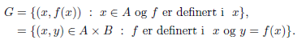
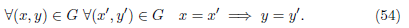
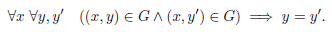
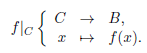

# Potensmengde, produkt, funksjoner/avbildninger.
## Aksiom 3.6 
Dersom $A$ er en mengde utgjør delmengdene til $A$ en mengde, kalt *potensmengden* til $A$, som skrives $\wp (A)$:$$\wp (A)=\{B\; :\; B\subseteq A\}$$

## Aksiom 3.7 
Gitt mengder $A$ og $B$ er *produktet* av $A$ og $B$ veldeinert ved: $$A\times B=\{z\; : \; \exists x\in A \;\;\; \exists y\in B \;\;\; z=(x,y)\}$$ Det er vanlig å omskrive: $$A\times B=\{(x,y)\; :\; x\in A\land y\in B\}$$

## Definisjon 3.6 
En *graf* er en mengde bestående av par. Gitt mengder $A$ og $B$ er en graf fra $A$ til $B$ en delmengde av $A\times B$.

## Definisjon 3.7
Dersom $f: A\to B$ er en funksjon er grafen til $f$ :

I situasjonen over er grafen $G$ til $f$ altså en delmengde av $A\times B$. Men
den er spesiell, for den har egenskapen:

## Definisjon 3.8
Hvis G er en graf sier vi at G er funksjonell, dersom den tilfredsstiller (54), som også kan skrives:

## Definisjon 3.9
La $f$ være en funksjonell graf. 
* Dersom $(x,y)\in f$ er $y$ entydig bestemt av $x$, kallles veridien til $f$ i $x$ og betegnes som $f(x)$.
* *Definisjonsmengden* til $f$ er: $$D_f=\{x : \exists y\quad (x,y)\in f\}$$
* *Verdimengden* til $f$ er: $$V_f=\{y : \exists x\quad (x,y)\in f\}$$

## Definisjon 3.10
En *funksjon* er en trippel $f = (A,B,G)$ slik at $G\subseteq A\times B$ og $G$ er funksjonell.

## Definisjon 3.11
La $f=(A,B,G)$ være en funksjon. Vi definerer: 
* *Domenet* til $f$ er $A$ og *kodomenet* til $f$ er $B$.
* Definisjonsmengden $D_f$ og verdimengden $V_f$ til $f$ er de tilsvarende allerede definert for $G$.
* Dersom $x\in D_f$ er verdien til $f$ i $x$ det elementet $y$ i $B$ slik at $(x,y)\in G$.

## Definisjon 3.12
En avbildning er en funksjon som er definert på hele sitt domene. Vi uttrykker at $f$ er en avbildning med domene $A$ og kodomene $B$ ved å skrive $f : A\to B$.

## Definisjon 3.13
Gitt avbildninger $f : A\to B$ og $g : B\to C$ kan vi danne en avbildning $g\circ f$, kalt komposisjonen av $g$ og $f$, eventuelt « $g$ ring $f$ », definert ved:

## Lemma 3.1 
Dersom $f\; :\; A\to B$, $g\; :\; B\to C$ og $h\; :\; C\to D$ har vi $h\circ (g\circ f)=(h\circ g)\circ f$

## Definisjon 3.14
Gitt $f: A\to B$ og $C\subseteq A$ kan vi danne *restriksjonen* av $f$ til $C$ :

Gitt $g: C\to B$ og $C\subseteq A$ sier vi at $f : A\to B$ er en *utvidelse* av $g$ dersom $f|_C = g$.
