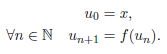
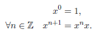
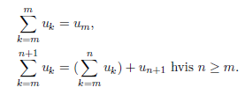
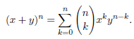
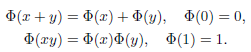

# 7 Ekvivalens- og ordens-relasjoner.
## Definition 7.1
La $\mathcal{R}$ være utstyrt med addisjon og multiplikasjon slik at vi har å gjøre med en kommutativ ring. Anta videre at $\mathcal{R}$ er utstyrt med en orden $\leq$. Vi sier at ordenen er kompatibel med addisjon og multiplikasjon når følgende holder: $$\forall x,y,z \quad x\leq y\implies x+z\leq y+z$$ $$\forall x,y \quad (0\leq x\land 0\leq y)\implies 0\leq xy$$ En *ordnet ring* er en ring utstyrt med en orden som er kompatibel med addisjon og multiplikasjon. En *totalt ordnet ring* er ordnet ring der ordenen er total, mens en *partielt ordnet ring* er en ordnet ring der ordenen er partiell.

## Aksiom 7.1
(Induksjon) La $P$ være en egenskap definert på $\mathbb{N}$ (mao. har vi et utsagn $P(n)$ for hver $n\in \mathbb{N}$). Dersom vi har:
* $P(0)$ er sant,
* $\forall n\in I_m \quad P(n)\implies P(n+1)$

## Teorem 7.1
La $A$ være en ikke-tom mengde. En følge i $A$ er en avbildning fra $\mathbb{N}$ til $A$. 
&nbsp;&nbsp;&nbsp;&nbsp; Notasjon: Dersom $u : \mathbb{N}\to A$ er en følge er det vanlig å skrive $u_n$ heller enn $u(n)$ for verdien til $u$ i $n\in \mathbb{N}$, og å betegne følgen som $(u_n)_{n\in \mathbb{N}}$. Vi foreslår at man også kan skrive følgen $u$ som: $(u_n : n\in \mathbb{N})$

## Teorem 7.2
(Følger definert ved induksjon). For hver mengde $A$, for hver avbildning $f : A\to A$ og for hvert element $x\in A$ finnes det en og bare en følge $(u_n)_{n\in \mathbb{N}}$ i $A$ slik at:

## Teorem 7.5
For hver mengde $A$, for hver bijeksjon $f : A\to A$ og for hvert element $x\in A$ finnes det en og bare en følge $(u_n)_{n\in \mathbb{Z}}$ i $A$ slik at:

## Definisjon 7.2
(Summasjonstegn) La $A$ være utstyrt med en addisjon (assossiativ, kommutativ med neutralt element $0$). Vi definerer summen til følger $(u_k)_{k\in [m,n]}$, ved induksjon på $n\; (n\geq m)$. Vi krever at:

Vi føyer også til følgende definisjon: $$\sum_{k=m}^{n} u_k=0\; \text{hvis}\; n< m$$

## Teorem 7.11
La $x$ og $y$ være kommuterende elementer i en ring. Da har vi, for hver $n\in \mathbb{N}$:

## Definisjon 7.3
(Morfier) La $A$ være utstyrt med en operasjon $\star$ og $B$ være utstyrt med en operasjon $\ast$. Da er en morfi fra $(A,\star)$ til $(B, \ast)$ en avbildning $\Phi : A\to B$ som tilfredsstiller: $$\Phi (x\star y)=\Phi (x)\ast \Phi (y)$$ Dersom $A$ har et neutralt element $e$ og $B$ har neutralt element $f$ er en morfi fra $(A,\star ,e)$ til $(B,\ast ,f)$ en morfi fra $(A,\star)$ til $(B,\ast)$ slik at $\Phi (e)=f$.

## Definisjon 7.4 
La $\mathcal{R}$ og $\mathcal{R}'$ være to ringer. En ring-morfi er en avbildning $\Phi : \mathcal{R} \to \mathcal{R}'$ slik at $\Phi$ er en morfi med hensyn på både addisjon og multiplikasjon. Med andre ord krever man:

## Teorem 7.14
Dersom $\mathcal{R}$ er en ring finnes det en og bare en ring morfi $\Phi : \mathbb{Z} \to \mathcal{R}$. Hvis $\mathcal{R}$ i tillegg er ordnet vil $\Phi$ være voksende.