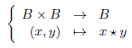

# 8 Operasjoner
## Definisjon 8.1
En operasjon på en mengde $A$ er en avbildning fra $A\times A$ til $A$.

## Definisjon 8.2
La $\star : A\times A \to A$ være en operasjon. For $x,y \in A$ skriver vi $x\times y$ i stedet for $\times (x,y)$. 
* Vi sier at operasjonen er *assosiativ* dersom: $$\forall x,y,z \in A\quad (x\star y)\star z= x\star (y\star z)$$
* Vi sier at $e\in A$ er et *neutralt element* dersom: $$\forall x\in A\quad e\star x=x\star e=x$$
* Vi sier at to elementer $x,y \in A$ *kommuterer* dersom $x\star y= y\star x$. Vi sier at operasjonen er *kommutativ* dersom $x$ og $y$ kommuterer for alle $x,y \in A$

## Definisjon og Proposisjon 8.3
La $A$ være utstyrt med en assosiativ operasjon og et neutralt element $e$. La $x\in A$. Vi sier at $x$ er invertibel dersom det finnes $y\in A$ slik at $xy = yx = e$. I såfall er $y$ entydig bestemt av $x$ og kalles inversen til $x$.

## Definisjon 8.4
La $A$ være utstyrt med en operasjon $\star$. Man sier at en delmengde $B$ av $A$ er *stabil* under $\star$ dersom: $$\forall x,y\in B\quad x\star y \in B$$
I såfall kan man utstyre $B$ med den såkalte induserte operasjonen:

## Definisjon 8.5
La $B$ være utstyrt med en operasjon $\star$. La $A$ være en ikke-tom mengde. Vi utstyrer $B^A$ med en operasjon også kalt $\star$ som følger. For $f,g\in B^A$ definerer vi $f\star g\in B^A$ ved: $$\forall x\in A\quad (f\star g)(x) = f(x)\star g(x)$$
Merk at vi bruker operasjonen på $B$ i høyre ledd. Vi sier at operasjonen på
$B^A$ er indusert av operasjonen på $B$, punktvis.

## Definisjon 8.6
En monoide er en trippel $(A, \star, e)$ slik at $\star$ er en operasjon på $A$ som er assosiativ og har neutralt element $e$. Man sier at monoiden er kommutativ dersom operasjonen er kommutativ. Det er vanlig å si at den underliggende mengden $A$ er en monoide, når det er underforstått hva operasjonen og det neutrale elementet er. 
&nbsp;&nbsp;&nbsp;&nbsp; Man sier at $A$ er utstyrt med en monoidestruktur når man har valgt en operasjon $\star$ og element $e$, slik at $(A, \star, e)$ er en monoide.

## Definisjon 8.7
En gruppe er en monoide, slik at hvert element er invertibelt. En gruppe sies å være kommutativ, eventuelt Abelsk, dersom operasjonen er kommutativ. 
&nbsp;&nbsp;&nbsp;&nbsp; Man sier at $A$ er utstyrt med en gruppestruktur når man har valgt en operasjon $\star$ og element $e$, slik at $(A, \star, e)$ er en gruppe.

## Definisjon 8.8
La $(A, \star, e)$ være en monoide. En undermonoide av $(A, \star, e)$ er en monoide på formen $(A', \star, e)$ der $A'$ er en delmengde av $A$ som er stabil under operasjonen $\star$ og som inneholder $e$. Det er underforstått at $A'$ utstyres med operasjonen man får ved restriksjon av operasjonen $\star$ på $A$, og at denne også skrives $\star$.

## Definisjon 8.9
La $(A, \star, e)$ være en gruppe. En undergruppe av $(A, \star, e)$ er en undermonoide $(A', \star, e)$ som også er en gruppe. Dette kan formuleres som at $A'$ må være stabil under operasjonen $\star$, inneholde $e$ og være stabil under inverteringsavbildningen: $$\forall x\in A' \quad x^{-1} \in A'$$
