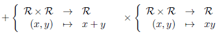
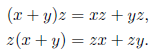

# Ring, ordnet ring, summering.
## Definisjon 1.10
Vi betrakter en mengde $R$, utstyrt med to avbildninger kalt addisjon $(+)$ og multiplikasjon $(\times)$:

og to utvalgte elementer $0$ og $1$. 
Vi sier at $(\mathcal{R}, +, 0, 1)$ er en ring dersom:

* addisjon er assosiativ, kommutativ, har neutralt element $0$ og hvert element $x$ har en invers (som skrives $−x$).
* multiplikasjon er assosiativ og har neutralt element $1$.
* multiplikasjon distribuerer over addisjon, i den forstand at for alle $(x, y, z\in \mathcal{R})$ har vi:

Med andre ord krever vi at $(\mathcal{R},+, 0)$ er en kommutativ gruppe, at $(\mathcal{R},×, 1)$ er en monoide, og at multiplikasjon distribuerer over addisjon.

## Definisjon 1.11
La R være en ring.
* Vi sier at $\mathcal{R}$ er triviell dersom 0 = 1. Da har vi $\mathcal{R} = \{0\}$.
* Vi sier at $\mathcal{R}$ er kommutativ dersom multiplikasjonen er kommutativ.
* Vi sier at $\mathcal{R}$ er et integritetsdomene dersom $\mathcal{R}$ er ikke-triviell, kommutativ og hvis vi har: $$\forall x,y \quad xy=0\implies (x=0 \lor y=0)$$
* Vi sier vi at $\mathcal{R}$ er en kropp dersom $\mathcal{R}$ er ikke-triviell, kommutativ og alle elementer bortsett fra $0$ har en multiplikativ invers.